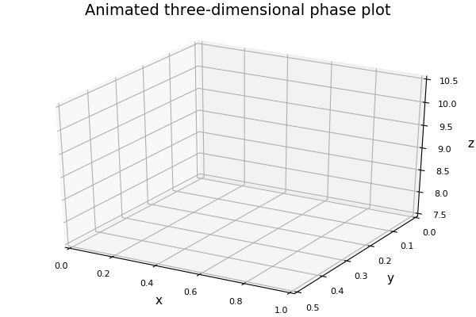

# [Re] Chaos in a Three-Species Food Chain
## 2019 Replication of Hastings & Powell (1991)

This project is a replication and implementation in *Julia v1.3.1* of Hastings & Powell (1991), a classic paper in ecological modelling. Full reference to the original article:

> Hastings, A., & Powell, T. (1991). Chaos in a Three-Species Food Chain. Ecology, 72(3), 896–903. https://doi.org/10.2307/1940591

The goal of this project was to test if the results of the original paper could be reproduced, as well as to provide a fully reproducible version for it on GitHub.

The reproduction was successful for all important results. As a bonus, we represented the dynamics of the three-species system in the following animated 3D GIF:



### Model reproduction

All the scripts required to reproduce the model are in the `code/` subfolder.
They assume that `code/` is used as the working directory.

#### Initial setup
To reproduce our project, we recommend the following steps as initial setup, assuming *Julia* is already installed and a UNIX-like terminal is used:
1. Clone this repository
```
git clone https://github.com/BIO6032/2019_replication_HastingsPowell_1991.git
```
2. Launch *Julia* in the repository and set `code/` as the working directory:
```
julia
cd("code")
```
3. Run the following command to install the exact versions of packages (as specified in the Project Environment)
```
]instantiate .
```

#### Running model
`main.jl` can be run to reproduce all figures after setup. Alternatively, individual scripts in `code/` can be run interactively after running lines 1-15 of `main.jl`.

### Article reproduction

Our article uses the [ReScience C](https://rescience.github.io/) journal template. All elements are in the `article/` subfolder. Instructions to reproduce the article are provided in the subfolder [README](article/README.md).
